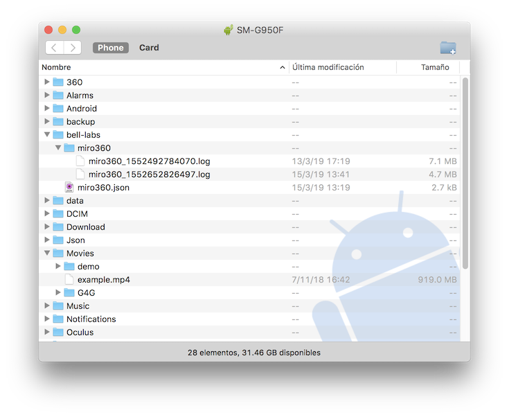

# MIRO360
MIRO360 is a tool for subjective assessment of 360 degree video compatible
with the (draft) Recommendation ITU-T P.360-VR.

## Features
- Test session configured with single JSON file.
- Each sequence may have different questions / methods.
- In-sequence quality evaluation:
  - Single-Stimulus Continous Quality Evaluation (SSCQE).
  - Single-Stimulus Discrete Quality Evaluation (SSDQE).
  - Built-in categorical scales (ACR, DCR, Vertigo, Dizzy, Likert).
  - User-defined categorical scales.
- Post-sequence quality evaluation:
  - Media quality: ACR, DCR
  - Simulator Sickness: Vertigo, Dizzy
  - Presence: SPES, Mini-MEC-SPQ
  - User-defined methodologies (single or multiple item)
- Automatic randomization of session (optional)
- Head tracking (3 DoF)
- Results in CSV format 

[See paper](doc/miro360.pdf) for more details.

### Compatibility
MIRO360 has been developed using [Gear VR Framework](http://www.gearvrf.org/).
As such, it should work with Samsung Gear and Google Daydream devices.

So far it has been successfully tested on:

- Samsung Galaxy S8 + Samsung Gear HMD.
- Google Pixel 2 + Google Daydream HMD.

## Citation
If you use this software in your research, please cite the 
following article... 

(*Article submitted to QoMEX 2019. Information to be updated upon acceptance.*)

## Installation

This is a development application, and therefore it must be built from sources.

So basically you need to do the [standard procedure](http://www.gearvrf.org/getting_started/):

1. Clone this repo.
1. Install Android Studio.
1. Open the project with Android Studio.
1. If you are installing in a Gear VR device (Samsung), 
make sure to download your [Oculus signature file](https://dashboard.oculus.com/tools/osig-generator/)
and copy it under `app/src/main/assets` folder
1. Build and install. Android Studio should handle [the dependencies](http://www.gearvrf.org/getting_started/#software-requirements)
(Oculus Mobile SDK and Google VR SDK).

### Android permissions
After installation, you need to manually enable permissions to access storage:

On your Android device, navigate to `Settings > Apps > MIRO360 > Permissions` 
and enable `Storage`. 

## Running MIRO360
To run the application for the first time:

- Create a new folder named `bell-labs` in your Android device storage.
- Copy the file [config/miro360.json](config/miro360.json) into
the `bell-labs` folder.
- Copy an example video named `example.mp4` into the `Movies` folder
of your Android device. 

The example video must be in equirectangular format, monoscopic, and with
a duration of at least 180 seconds. If you don't have anything available,
you can download this [example.mp4](http://gti.ssr.upm.es/~pab/example.mp4)
(1GB file!).

See the following picture for an example of phone storage,
including config file, example.mp4 and results.

### Results

Results are stored under `bell-labs/miro360`. Each session is 
stored in a different csv file. File structure has the following format:

`timestamp,pvs_id,uri,section,event,x[,y,z]`

Where:

- `timestamp` is the timestamp of the event, in nanoseconds.
It is stored in UNIX Epoch time, and it is guaranteed to be
monotonic within each file.
- `pvs_id` is simply the order of the PVS in the configuration file.
- `uri` is the URI of the file, in the format `uri:start_time`. Adding
`start_time` allows to create tests from cuts of long sequences and
easily differenciate them in the results file.
- `section` is one of 
  - `idle`: The screen shows "click to continue".
  - `video`: The sequence is playing.
  - `idle`: Post-sequence questionnaire.
- `event` is the type of event recorded. See below.
- `x,y,z` are the values of the event. Most events have a single value
(just `x`). Only `LOOK_AT` uses `x,y,z`.

Events are related to

- Application workflow:
    - `START` of the test
    - `END` of the test
    - `STATE_CHANGE` each time the section changes
- User behaviour:
    - `LOOK_AT`: user gaze (head tracking). Unit vector of gaze position (x,y,z)
- In-sequence evaluation:
    - `SSCQE`: value of SSCQE scale (0-99). An event is triggered each time the user
    changes the value in the control slider.
    - `SSDQE`: value of the SSDQE response (1-5). An event is triggered for each
    SSDQE answer. If there is no answer to a question, no event is generated.
- Post-sequence evaluation: The name of the event is the "tag" of each item in
the questionnaire (see [Configuration README](config/README.md) for details). 
The following questionnaires are already implemented:
    - `ACR` and `DCR`.
    - `VERTIGO` and `DIZZY` simulator sickness questionnaires.
    - Spatial Presence Experience Scale (SPES), including four items for 
    "Self Location" (`SPES.SL1`, `SPES.SL2`, `SPES.SL3`, `SPES.SL4`) and
    four items for "Possible Actions" (`SPES.PA1`, `SPES.PA2`, `SPES.PA3`, `SPES.PA4`).
    - Subsampling of MEC Spatial Presence Questionnaire, with a single
    question for each factor: `MEC.AA` (Attention Allocation), 
    `MEC.SSM` (Spatial Situation Model), `MEC.SPSL` (Self Location),
    `MEC.SPPA` (Possible Actions), `MEC.HCI` (High Cognitive Involvement), 
    `MEC.SOD` (Suspension of Disbelieve).
 
 
 
### Configuration

To run your own test, modify the configuration file `miro360.json`.

See the [Configuration README](config/README.md) for details. 

 

## License

MIT License

Copyright (c) 2019 Nokia

Permission is hereby granted, free of charge, to any person obtaining a copy
of this software and associated documentation files (the "Software"), to deal
in the Software without restriction, including without limitation the rights
to use, copy, modify, merge, publish, distribute, sublicense, and/or sell
copies of the Software, and to permit persons to whom the Software is
furnished to do so, subject to the following conditions:

The above copyright notice and this permission notice shall be included in all
copies or substantial portions of the Software.

THE SOFTWARE IS PROVIDED "AS IS", WITHOUT WARRANTY OF ANY KIND, EXPRESS OR
IMPLIED, INCLUDING BUT NOT LIMITED TO THE WARRANTIES OF MERCHANTABILITY,
FITNESS FOR A PARTICULAR PURPOSE AND NONINFRINGEMENT. IN NO EVENT SHALL THE
AUTHORS OR COPYRIGHT HOLDERS BE LIABLE FOR ANY CLAIM, DAMAGES OR OTHER
LIABILITY, WHETHER IN AN ACTION OF CONTRACT, TORT OR OTHERWISE, ARISING FROM,
OUT OF OR IN CONNECTION WITH THE SOFTWARE OR THE USE OR OTHER DEALINGS IN THE
SOFTWARE.
